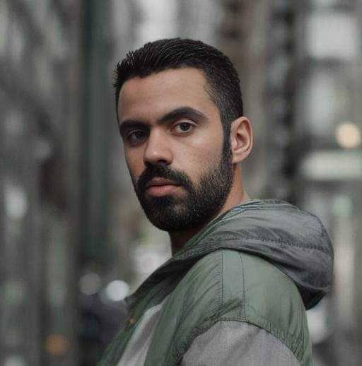

<!DOCTYPE html>
<html lang="en">
<head>
<meta charset="UTF-8">
<meta name="viewport" content="width=device-width, initial-scale=1.0">
<title>Marwane Mellouk - Black Coffee</title>

</head>
<body class="light">

<!-- زر تبديل الوضع -->
<button class="toggle-btn" onclick="toggleMode()">🌙 / ☀️</button>

<!-- صورة دائرية -->

<marquee direction="right">Moroccan Sahara🇲🇦☕</marquee>

<!-- بطاقة التعريف -->

    <h1 style="color: pink;">☰</h1>
    <h1 style="color: black;">𝕄𝕒𝕣𝕨𝕒𝕟𝕖 𝕄𝕖𝕝𝕝𝕠𝕦𝕜 🅥</h1>
    <h1 style="color: orange;">Black coffee Mr. Marwan Malook☕</h1>
    

    <h6>Takbisa updated ☁️⬇️</h6>
    <h6>Number of views on the site: 1000</h6>
    <h6>Date modified: 4/1/2026✎</h6>

<!-- بطاقة عن الكاتب -->

    <h1 style="color: red;">Information board📋</h1>
    
☛ About me: My name is Marwan Malouk from Morocco, residing in the United States of America. My profession is a content creator and influencer on social media. My work is a web programmer. This is my personal website, where I publish everything that concerns me.

    <h6>Takbisa updated ☁️⬇️</h6>
    <h6>Number of views: 31 ♥︎</h6>
    

    <h6>Writer: Marwan✎</h6>

<!-- بطاقة الغضب -->

    <h1>Anger is a disease ☀︎</h1>
    <h2>There is no cure for this neurological disease. If you suffer from it, you will feel something abnormal; you will break everything in front of you and hate yourself.</h2>
    <h6>Post✎</h6>

<!-- بطاقة بوت التليجرام -->

    <h2>This is my channel on Telegram. There is a bot in it 🤖</h2>
    <a href="https://t.me/Developers230" class="btn">Go to Telegram Bot</a>
    <h6>A look at this bot and its development story 🤖</h6>
    
This bot has a different story. Its code was developed and it took me about 12 hours to develop it. Suddenly, the internet was cut off and without realizing it, my mobile phone was broken. This is the first project for which a mobile phone was broken. It was a miracle. 🤖😂💔

    <h6>Number of views: 67 ♥︎</h6>
    <h6>To get in touch, message us on Telegram ☎︎☛ @blackCoffee987</h6>

<!-- بطاقة الحقوق -->

    <h2 style="color: yellow;">All rights reserved to Marwan website 2026</h2>

<marquee direction="right">Moroccan Sahara🇲🇦☕</marquee>

</body>
</html>
