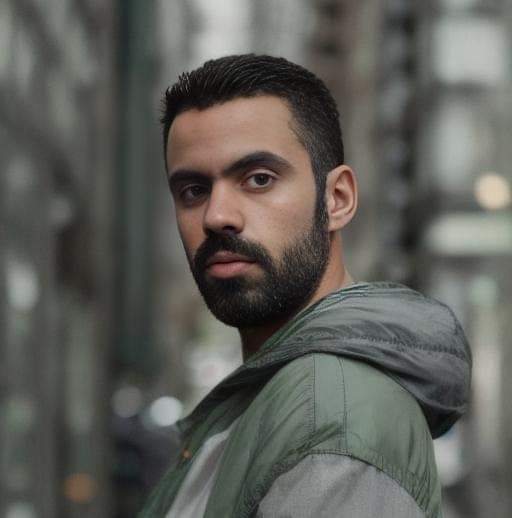

<!DOCTYPE html>
<html lang="ar" dir="rtl">
<head>
<meta charset="UTF-8">
<meta name="viewport" content="width=device-width, initial-scale=1.0">
<title>BC.Inc - Marwane Mellouk</title>

<link rel="stylesheet" href="https://cdnjs.cloudflare.com/ajax/libs/font-awesome/6.4.2/css/all.min.css" integrity="sha512-a7VgX9mXzqZ/w+PoFqD2x7FG9U64nKw6l7v6bZ9+T7pG9B8LxN5bD6kD3B3Y2kRkaRbF+JQkOZL2R3vRKwD8g==" crossorigin="anonymous" referrerpolicy="no-referrer" />

</head>
<body class="dark">

<canvas id="crypto-canvas"></canvas>

<button class="toggle-btn" id="modeBtn"><i class="fas fa-moon"></i></button>

    <h1 class="company-title">BC.Inc</h1>
    <h2 class="subtitle">مؤسس خوارزمية نظام رسالة مشفرة 🔒</h2>

    <marquee direction="right">Moroccan Sahara 🇲🇦 ☕ خوارزميات التشفير المتقدمة وحماية البيانات</marquee>

    <h2><i class="fas fa-key" style="margin-left: 10px;"></i>نظام التشفير المعتمد</h2>
    

        
<strong>اسم التشفير:</strong> Mellouk Dot-Bracket Cipher

        
<strong>الوصف:</strong> نظام ترميز يعتمد على فصل الحروف بنقاط، استخدام أقواس لتحديد الرسالة، وتوظيف أشكال حروف غير قياسية وعلامات ترقيم كجزء من المعنى الداخلي للمحتوى الموجه.

        
<strong>المصمم:</strong> Marwane Mellouk

        
<strong>تاريخ الإنشاء:</strong> 2026/02/05

        
<strong>مثال أصلي للرسالة المشفرة:</strong>

        [ک.ل.اًر.ك.ش.ح.ي.ح.ص.ك.م.ل.ا.ك.م ع؟ن]
    

    

        <i class="fas fa-eye"></i> عدد المشاهدات: 1000
        تاريخ التحديث: 2026/04/01✎
    

    <h2><i class="fas fa-graduation-cap" style="margin-left: 10px;"></i>دليل تعليمي: كيف تشفر رسالتك آمنًا؟</h2>
    
لحماية خصوصيتك قبل إرسال أي معلومات عبر شبكات التواصل، اتبع الهيكلية الكلاسيكية المتبعة في الأنظمة الأمنية المحسنة:

    <ul class="step-list">
        <li><strong>أولاً:</strong> قم بصياغة نصك الأصلي بوضوح بعيدًا عن أي منصة إرسال.</li>
        <li><strong>ثانيًا:</strong> وظّف خوارزمية الفصل (عبر النقاط وعلامات الترقيم المخصصة) لتشتيت قارئي الحزم اللاسلكية.</li>
        <li><strong>ثالثًا:</strong> أغلق رسالتك بالأقواس المحددة العازلة لمنع التلاعب بطول الرسالة (Data Integrity).</li>
    </ul>
    

        <i class="fas fa-shield-alt"></i> المنصة التعليمية الآمنة
        الكاتب: Marwane✎
    

    <h2><i class="fas fa-user-shield" style="margin-left: 10px;"></i>لوحة معلومات المؤسس📋</h2>
    
مرحباً بك، معكم مروان ملوك من المغرب. أعمل كمبرمج ويب ومتخصص في صياغة المحتوى التقني والتوعوي على شبكات التواصل الاجتماعي. هذا الموقع يمثل منصتي الرسمية لشركة <strong>BC.Inc</strong>، حيث أشارككم أحدث الابتكارات البرمجية، وخوارزميات الأمن الرقمي، والأنظمة المخصصة التي أقوم بتطويرها.

    

        <i class="fas fa-heart"></i> التفاعل: 31
        موثق بالكامل بـ 2026
    

    <h2><i class="fab fa-telegram" style="margin-left: 10px;"></i>المستودع البرمجي وبوت التواصل 🤖</h2>
    
<strong>قصة تطوير البوت:</strong>

    
هذا المشروع يحمل طابعاً خاصاً وكفاحاً حقيقياً؛ استغرق تطوير الكود البرمجي الخاص به حوالي 12 ساعة متواصلة من العمل الدؤوب. وفي لحظة غير متوقعة، انقطع الاتصال بالإنترنت تماماً وتزامن ذلك مع عطل مفاجئ أدى إلى كسر هاتفي المحمول! يُعد هذا أول مشروع تقني ينتهي بكسر هاتف ذكي، لكن خروج البوت للعلن كان بمثابة معجزة تقنية تستحق العناء. 🤖😂💔

    
    <a href="https://t.me/Developers230" class="btn" target="_blank">
        <i class="fab fa-telegram-plane"></i> الانتقال إلى بوت تلغرام
    </a>
    
    

        <i class="fas fa-bolt"></i> المشاهدات: 67
        للتواصل المباشر: @blackCoffee987 ☎︎
    

    <h2><i class="fas fa-brain" style="margin-left: 10px;"></i>التوعية النفسية: الغضب مركب هدّام ☀︎</h2>
    
في عالم البرمجة والأمن، الحفاظ على الهدوء هو السلاح الأول. الغضب يشبه الفيروس العصبي الذي لا يترك خلفه سوى القرارات الخاطئة؛ يجعلك تدمر كل ما بنيته وتفقد السيطرة على أدواتك. حماية ذاتك نفسياً لا تقل أهمية عن حماية برمجياتك.

    

        مقالة توعوية قصيرة
    

    <marquee direction="right">BC.Inc © 2026 - جميع الحقوق محفوظة لموقع مروان ملوك المطور</marquee>

    
جميع الحقوق محفوظة لشركة BC.Inc وموقع مروان 2026

</body>
</html>
